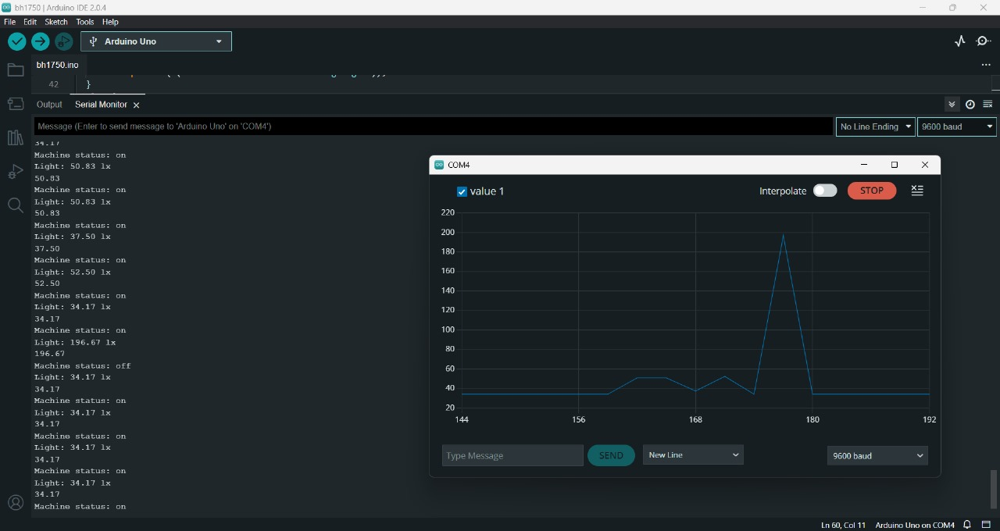
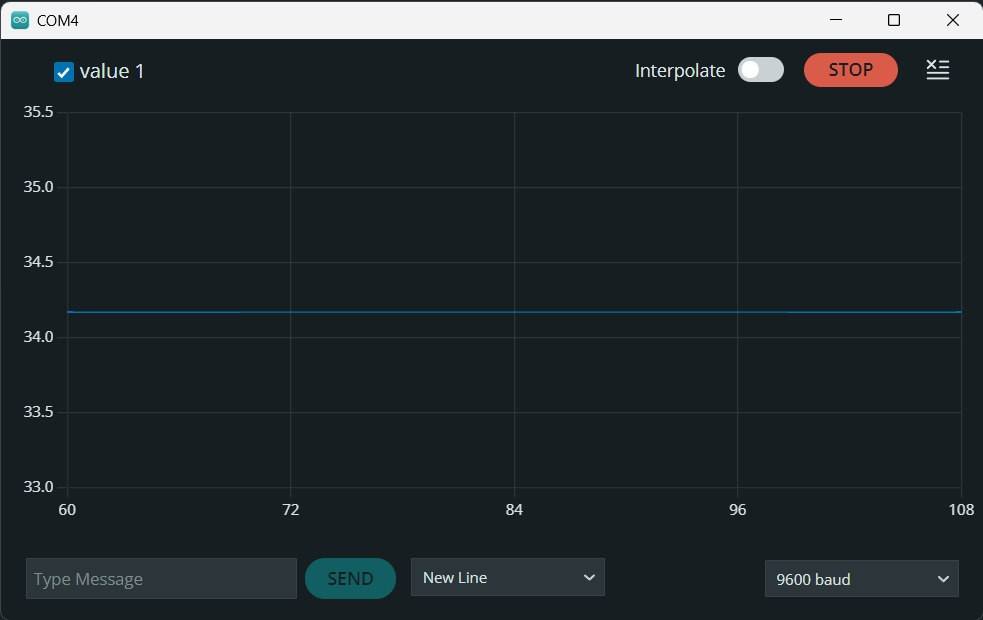

# 🧵 IoT-Based Smart Monitoring System for the Textile Industry

A smart embedded system using IoT and light intensity sensors (BH1750) to monitor the idle time of textile machinery in real-time. This project improves production efficiency and reduces electricity consumption by detecting machine shutdowns and alerting workers instantly.

---

## 📌 Key Features

- 📡 Real-time monitoring of textile machines (Guarding, Simplex, RSP)
- 💡 Uses BH1750 sensor to detect buzzer light indicating machine status
- ⏱️ Alerts workers when machine remains idle for >15 minutes
- 📲 Data transmitted to mobile app or web dashboard
- 📈 Enables performance tracking and idle-time analysis
- 🔌 Reduces electricity wastage and boosts industrial efficiency

---

## 🛠️ Tech Stack & Components

### Languages & Hardware:

### Components Used:
- **Arduino UNO** – For program control
- **BH1750** – Light intensity sensor to detect buzzer status
- **ESP32** – WiFi module for connectivity
- **LCD Display** – Displays machine status updates
- **Buzzer Light** – Installed on textile machines
- **Jumper Wires & Breadboard** – For prototyping

---

## 📁 Project Structure

| File/Folder                 | Description                                   |
|----------------------------|-----------------------------------------------|
| `bh1750.ino`               | Arduino code for monitoring and sensing       |
| `BH1750-1.3.0/`            | Sensor library for BH1750 module              |
| `Image-1.jpg` to `Image-3.jpg` | Output visuals                |
| `IOT PROJECT FOR TEXTILE INDUSTRY 50.pptx` | Project presentation         |

---

## 🚀 How It Works

1. **Buzzer light** turns ON when a thread breaks and the machine stops.
2. **BH1750 sensor** measures light intensity from the buzzer.
3. If light is ON for >15 minutes, alert is sent via **ESP32 WiFi**.
4. Data is logged and pushed to a **mobile app/web interface**.
5. Admin can monitor machine performance and idle duration.

---

## 📸 Demo & Output Samples

### 📷 Output Visuals
  
  

---

## 📊 Impact

- 🔧 Reduces machine idle time
- ⚡ Lowers electricity usage
- 📈 Improves worker accountability and efficiency
- 💸 Budget-friendly solution for small-scale textile industries

---

## 📖 License

This project is licensed under the [MIT License](LICENSE) © 2025 Mithunsankar S and Team.

